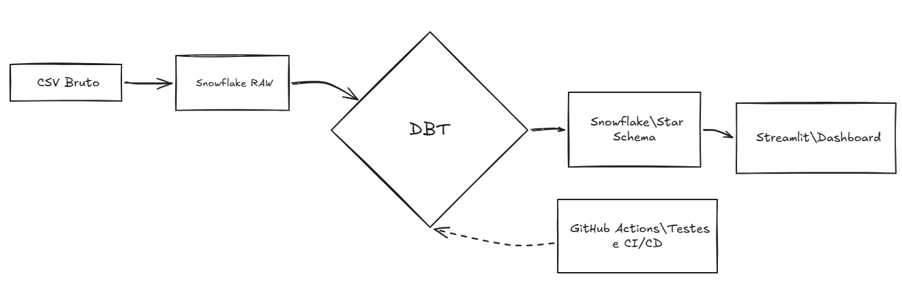
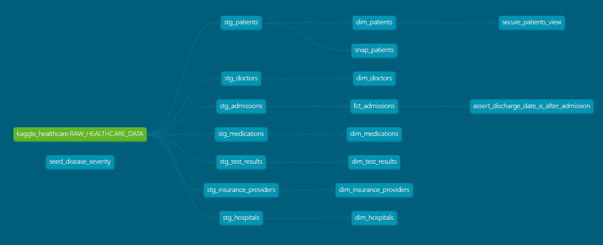

#  Pipeline End-to-End | dbt + Snowflake + Streamlit + CI/CD
Transformando dados brutos de saúde em uma Torre de Controle Executiva.



Acessar o Dashboard: https://dbt-hospital-dhhha2cbaeftcrtxyxqpfr.streamlit.app/


```markdown
#  Pipeline de Analytics Engineering: Healthcare Data Platform

Este repositório contém a infraestrutura de modelagem analítica para dados de saúde, desenvolvida utilizando as práticas modernas de Analytics Engineering através do **dbt Core (v1.11)**, **Snowflake Data Warehouse** e esteira automatizada de **CI/CD via GitHub Actions**.

O objetivo estratégico do projeto é transformar um conjunto de dados brutos altamente acoplados (uma tabela única e achatada oriunda de sistemas legados de saúde) em um modelo dimensional limpo, governado e otimizado para tomadas de decisão executivas e inteligência preditiva.

---

##  1. Arquitetura da Plataforma e Linhagem de Dados

O projeto adota a arquitetura de dados em camadas (**Medallion Architecture**), dividindo o ciclo de vida do dado em três estágios lógicos essenciais:

```text
 Landing Zone (RAW)           Camada Staging (dbt)                  Camada Marts (Dimensional)
+-----------------------+     +-------------------------------+     +---------------------------+
|                       |     | Fragmentação Lógica           |     |                           |
| Tabela Achatada Única | === | 7 Entidades Limpas            | === | Modelagem Star Schema     |
| (Fuso Horário e       |     | (Tipagem, Provedores,         |     | Fatos e Dimensões Finais  |
| Métricas Acopladas)   |     | Pacientes, Médicos...)        |     |                           |
+-----------------------+     +-------------------------------+     +---------------------------+

```

1. **Camada Bronze / RAW (Snowflake):** Ingestão literal e imutável do arquivo original `healthcare_dataset_2.csv`. Não há qualquer transformação nesta etapa, garantindo a rastreabilidade da origem dos dados.
2. **Camada Silver / Staging (dbt):** Fase de saneamento, normalização analítica e aplicação de governança. A tabela única é desmembrada em entidades de negócio, onde aplicamos tipagem rígida, tratamento de nulos e mascaramento de strings.
3. **Camada Gold / Marts (dbt):** Agrupamento das entidades em um modelo dimensional (*Star Schema*) focado em performance de leitura para ferramentas de Business Intelligence (BI) e Data Science.

---

##  2. Governança e Monitoramento de Origens (`sources.yml`)

A camada de entrada do Data Warehouse é monitorada de perto por regras automatizadas de qualidade e obsolescência de dados (*Data Freshness*):

* **Rastreabilidade de Carga:** O campo de auditoria `_loaded_at` registra o momento exato em que o dado bruto atingiu o ambiente do Snowflake.
* **Garantia de Atualização:** Foi configurada uma janela de monitoramento temporal de dados. O pipeline dispara um aviso (*Warning*) caso a origem passe de 12 horas sem receber novos registros, e entra em estado de erro crítico (*Error*) bloqueando a esteira caso atinja 24 horas de inatividade.

---

##  3. Engenharia de Transformação na Camada de Staging

Na camada de Staging, a tabela achatada original foi normalizada e decomposta em **7 entidades analíticas distintas**, isolando as dimensões de negócio da tabela de fatos operacionais.

### Conceitos Avançados de Engenharia Aplicados:

* **Chaves Substitutas Determinísticas (*Surrogate Keys*):** Como a origem não possuía IDs únicos de sistema, utilizamos o pacote `dbt_utils` para gerar hashes criptográficos `MD5` a partir de campos combinados. Isso garante chaves primárias consistentes, imutáveis e de alta performance de junção no Snowflake.
* **Padronização Textual:** Aplicação sistemática de limpeza de strings (`UPPER` e `TRIM`) para eliminar divergências de caixa e espaços invisíveis, preparando os dados textuais para o consumo uniforme em relatórios corporativos ou modelos de IA.
* **Tratamento de Nulidades:** Substituição de valores ausentes em campos críticos (como provedores de saúde) por termos padronizados (`NÃO INFORMADO`), mitigando distorções em cálculos analíticos.
* **Tipagem Estrita:** Conversão explícita de tipos de dados flexíveis do arquivo original para formatos tipados de banco de dados (`DATE`, `INT` e campos financeiros em `DECIMAL(10,2)`).

### Estrutura Lógica das Entidades Criadas:

* **`stg_admissions.sql`**: O modelo central de eventos. Centraliza os registros de internações e atua como o elo de conexão, armazenando as métricas financeiras (`billing_amount`), número de quartos (`room_number`), datas críticas e as chaves de relacionamento com todas as dimensões do hospital.
* **`stg_patients.sql`**: Isola os dados demográficos dos pacientes (Idade, Gênero e Tipo Sanguíneo), criando um identificador único com base nas características individuais estáveis do indivíduo.
* **`stg_doctors.sql`**: Consolida e limpa a listagem do corpo médico responsável pelos atendimentos.
* **`stg_hospitals.sql`**: Mapeia as diferentes unidades hospitalares presentes no ecossistema de atendimento.
* **`stg_insurance_providers.sql`**: Normaliza o catálogo de operadoras de planos de saúde responsáveis pelo custeio dos tratamentos.
* **`stg_medications.sql`**: Cataloga de forma única os medicamentos administrados durante os períodos de internação.
* **`stg_test_results.sql`**: Padroniza os possíveis status e desfechos clínicos de exames laboratoriais.

---

##  4. Camada de Modelagem Dimensional (Marts / Gold)

Na camada final de modelagem, as entidades saneadas na etapa anterior são estruturadas seguindo a metodologia **Kimball (Star Schema)**. O objetivo é criar tabelas dimensionais puras, otimizadas para junções rápidas na leitura, fornecendo um ambiente de alta performance para ferramentas de BI e analistas de negócio.

Nesta etapa, todas as dimensões são materializadas como **Tabelas (`table`)** dentro do Snowflake para garantir tempos mínimos de resposta nas consultas corporativas.

### Estratégia das Tabelas Dimensionais:

* **`dim_doctors` (Dimensão Médicos):** Consolida o cadastro exclusivo do corpo clínico. Implementa uma lógica de proteção contra falhas de sistema utilizando substituição nula (`COALESCE`), onde qualquer ausência de nome médico na origem é automaticamente mapeada como `MÉDICO PLANTONISTA GENÉRICO`, evitando relatórios analíticos com lacunas informativas.
* **`dim_hospitals` (Dimensão Hospitais):** Centraliza de forma estrita a lista de todas as instituições e unidades de atendimento que integram o ecossistema do dataset.
* **`dim_insurance_providers` (Dimensão Operadoras de Saúde):** Modela o catálogo consolidado das empresas de seguros e convénios médicos responsáveis pelo custeio dos procedimentos.
* **`dim_medications` (Dimensão Medicamentos):** Consolida e padroniza a listagem de fármacos que foram administrados aos pacientes ao longo de toda a série histórica.
* **`dim_test_results` (Dimensão Resultados de Exames):** Isolamento dos status lógicos de desfechos clínicos e exames (ex: NORMAL, ABNORMAL, INCONCLUSIVE), permitindo análises rápidas de taxas de diagnóstico por especialidade.

---

##  5. Regras Avançadas de Negócio e Deduplicação (`dim_patients`)

A dimensão de pacientes (`dim_patients`) é o ponto mais complexo e robusto da modelagem dimensional deste projeto. Como a origem baseia-se num histórico cumulativo de internações (onde um paciente pode internar-se múltiplas vezes), foi aplicada uma estratégia rigorosa de **Deduplicação e Inteligência Demográfica**:

### Técnicas Aplicadas na Entidade:

1. **Deduplicação Analítica com `QUALIFY`:** Para garantir a regra relacional de que *um paciente deve existir apenas uma única vez na dimensão*, utilizámos a cláusula avançada `QUALIFY` combinada com `ROW_NUMBER() OVER (PARTITION BY patient_id ORDER BY patient_age DESC, _loaded_at DESC)`. Esta janela garante que o modelo capture sempre o registo mais atualizado do paciente (sua idade mais recente e carga mais nova), eliminando dados duplicados antes da escrita final.
2. **Segmentação Dinâmica por Faixa Etária (Uso de Macros):** Em vez de fixar regras de faixas etárias (`CASE WHEN`) diretamente no código, utilizámos o poder das macros do dbt (`classify_age_group`). A macro avalia a idade recalculada do paciente e classifica-o dinamicamente em grupos (ex: Criança, Jovem, Adulto, Idoso). Isto garante reaproveitamento de código em qualquer outra tabela que meça idades.
3. **Resiliência a Nulos:** Todos os atributos demográficos (Nome, Idade, Género e Tipo Sanguíneo) possuem tratamentos explícitos com substituições como `PACIENTE NÃO INFORMADO` ou `NÃO TESTADO`, garantindo que a dimensão seja 100% blindada contra quebras de integridade.

---

##  6. Governação de Dados, Privacidade e Mascaração de Dados (`secure_patients_view`)

Pensando nos padrões de conformidade com leis de proteção de dados (como a **LGPD** ou **GDPR**), o projeto não expõe informações sensíveis diretamente à camada final de consumo de BI sem critérios de segurança.

Para resolver este problema de conformidade, foi desenvolvida a **`secure_patients_view`**:

* **Mascaração via Macro Dinâmica:** Desenvolvemos e aplicámos a macro `mask_sensitive_data` especificamente na coluna de tipo sanguíneo (`blood_type`).
* **Ocultação Estratégica:** Quando um utilizador ou analista comum interage com esta camada de dados, a macro interseta a consulta e mascara o valor real, garantindo que informações clínicas confidenciais dos pacientes permaneçam protegidas contra acessos não autorizados.
* **Arquitetura de Consumo:** Esta camada atua como um espelho seguro da dimensão original, garantindo que o Data Science e o BI consumam os dados demográficos necessários para volumetria sem infringir regras de privacidade do paciente.

---

##  7. Camada de Factos e Performance Incremental (`fct_admissions`)

O modelo `fct_admissions` é a tabela central do nosso ecossistema analítico (*Star Schema*). Ela consolida os eventos operacionais e financeiros das internações hospitalares, atuando como a ponte de ligação que consome as chaves substitutas de todas as dimensões (`dim_patients`, `dim_doctors`, etc.).

### Estratégia de Engenharia e FinOps:

* **Estratégia Materialização Incremental:** Para otimizar o processamento e reduzir drasticamente os custos computacionais no Snowflake, a tabela de factos foi configurada como **`incremental`**. Em vez de reconstruir milhões de linhas a cada execução, o dbt processa apenas os novos registos inseridos desde a última carga.
* **Governança de Schema:** Utiliza a configuração `on_schema_change='fail'`. Isto garante que qualquer alteração estrutural inesperada vinda da origem (como a exclusão ou alteração de tipo de uma coluna) bloqueie o pipeline imediatamente, impedindo a corrupção dos dados em produção.

---

##  8. Ecossistema de Engenharia Modular: Macros (Jinja)

Para evitar a repetição de código SQL complexo (*DRY - Don't Repeat Yourself*), a inteligência do projeto foi descentralizada em bibliotecas de **Macros reutilizáveis**, divididas por domínios de negócio:

### A. Regras Clínicas Hospitalares (`macro_clinical_rules`)

* **`classify_age_group`:** Avalia a idade calculada do paciente e agrupa-o dinamicamente em categorias demográficas (`CRIANÇA`, `ADOLESCENTE`, `ADULTO`, `IDOSO`).
* **`is_long_stay`:** Compara as datas de entrada e saída e gera uma flag booleana automática para monitorizar internações de longa permanência baseadas num limite customizável (ex: mais de 10 dias).
* **`group_medical_specialty`:** Agrupa centenas de diagnósticos brutos e caóticos em alas médicas e especialidades específicas do hospital (`ONCOLOGIA`, `CARDIOLOGIA`, `ENDOCRINOLOGIA`, etc.), simplificando a análise de ocupação de leitos.

### B. Cálculos Financeiros Dinâmicos (`macro_finance_utils`)

* **`apply_hospital_tax`:** Aplica taxas tributárias e operacionais hospitalares sobre os valores faturados (`billing_amount`), integrando variáveis globais parametrizadas diretamente no ficheiro de configuração do dbt.
* **`categorize_billing_tier`:** Segmenta os custos das internações em faixas financeiras legíveis para o negócio (`BAIXO CUSTO`, `MÉDIO CUSTO`, `ALTO CUSTO`).

### C. Utilitários de Sistema e Higienização (`macro_system_utils` & `macro_text_cleaners`)

* **`filter_incremental_data`:** Automatiza a injeção da cláusula `WHERE` incremental, detetando o valor máximo já existente na tabela de destino para capturar apenas dados novos.
* **`clean_string` & `safe_coalesce_text`:** Garantem a padronização absoluta de strings e tratamentos de nulos antes do dado atingir a camada analítica.

---

##  9. Enriquecimento com Dados Estáticos (`seed_disease_severity`)

Nem todos os dados analíticos vêm de sistemas transacionais dinâmicos. Regras de classificação institucional, por exemplo, costumam ser geridas por equipas de auditoria médica.

Para enriquecer as análises de saúde, utilizámos o recurso de **Seeds** do dbt para injetar o ficheiro `seed_disease_severity.csv` diretamente no Snowflake:

* **O que faz:** Este ficheiro atua como uma tabela de referência que mapeia cada condição médica (`CANCER`, `DIABETES`, `ASTHMA`) aos seus respetivos níveis de gravidade clínica (`ALTO`, `MÉDIO`, `BAIXO`) e indica se o diagnóstico exige isolamento hospitalar imediato (`isolation_required`).
* **Valor Prático:** Permite cruzar dados financeiros de custo por leito com o nível de gravidade da doença do paciente sem necessidade de tabelas externas de de-para.

---

##  10. Rastreabilidade Temporal Histórica: Snapshots (`snap_patients`)

Os sistemas de origem costumam atualizar os dados dos pacientes sobrescrevendo as linhas no banco de dados operacional (ocultando o histórico de alterações). Para garantir auditorias médicas e relatórios retroativos fiáveis, implementámos um **Snapshot** com a estratégia de monitorização lenta de dimensões (**SCD Tipo 2**).

* **Modelo Focado:** `snap_patients` monitoriza a tabela de Staging de pacientes.
* **Estratégia de Check:** Configurado para vigiar colunas críticas (`patient_name`, `blood_type`, `patient_gender`).
* **Comportamento no Data Warehouse:** Sempre que um atributo monitorizado mudar na origem, o dbt não apaga o registo antigo. Em vez disso, ele fecha a janela de validade do registo anterior (injetando uma data fim em `dbt_valid_to`) e abre uma nova linha com o dado atualizado. Isto permite ao hospital saber exatamente qual era o estado de cadastro do paciente em qualquer data específica do passado.

---

##  11. Automação de Qualidade, Testes de Dados e CI/CD

A confiabilidade da nossa plataforma de dados de saúde é blindada por uma esteira de **Integração Contínua (CI/CD)** automatizada através do **GitHub Actions**, operando de forma integrada ao Snowflake.

###  Matriz de Testes de Dados (Data Quality)

O pipeline executa uma bateria rigorosa de **32 testes automatizados** a cada execução:

* **Testes Nativos do Schema:** Garantem chaves primárias únicas (`unique`) e mandatórias (`not_null`) em todas as tabelas de dimensões e factos, além de validar a integridade referencial (*Foreign Keys*) entre a tabela de factos e as suas dimensões através de testes de `relationships`.
* **Testes Singulares Customizados:** Desenvolvemos regras de integridade lógica hospitalar personalizadas. O teste singular interseta a base de dados para garantir, por exemplo, que nenhuma data de alta hospitalar seja inferior ou anterior à data de internação do paciente. Qualquer quebra nesta regra de negócio faz o pipeline falhar imediatamente, impedindo que dados inconsistentes cheguem aos dashboards de BI.

###  Esteira Automática de CI/CD (GitHub Actions)

Sempre que um Engenheiro de Dados submete uma alteração de código ou cria uma nova modelagem analítica neste repositório:

1. O GitHub Actions acorda uma máquina virtual Linux isolada na nuvem.
2. Instala o ecossistema Python, dbt e todas as dependências necessárias do projeto.
3. Puxa de forma segura as chaves criptográficas de acesso do Snowflake (**Repository Secrets**) para assinar a conexão ignorando a necessidade de MFA humano.
4. Executa o dbt para compilar e testar exclusivamente os modelos alterados.

 12. Consumo de Dados: Centro de Controle Hospitalar (Dashboard)
Como camada final de apresentação e extração de valor, desenvolvemos um painel executivo interativo focado na melhor experiência de usuário (UI/UX em Dark Mode) para a tomada de decisão estratégica e clínica. O aplicativo web consome os dados tratados diretamente da nossa modelagem dimensional no Snowflake.

 Acessar o Dashboard: 
https://dbt-hospital-dhhha2cbaeftcrtxyxqpfr.streamlit.app/

O painel é estruturado em três abas analíticas principais:

Visão Geral Operacional: Acompanhamento do fluxo de leitos em tempo real (Admissões vs. Altas), análise de faturamento escalável, ticket médio financeiro por Ala Médica e distribuição do perfil de entrada (Urgência vs. Eletiva).

Desfechos Clínicos: Monitoramento da gravidade clínica cruzando resultados de exames com patologias, rastreamento de casos críticos (alertas de Long Stay) e análise da média de dias de internação.

Demografia e Suprimentos: Gestão inteligente da demanda do banco de sangue, controle do volume dos medicamentos mais prescritos e análise avançada do perfil demográfico dos pacientes.
